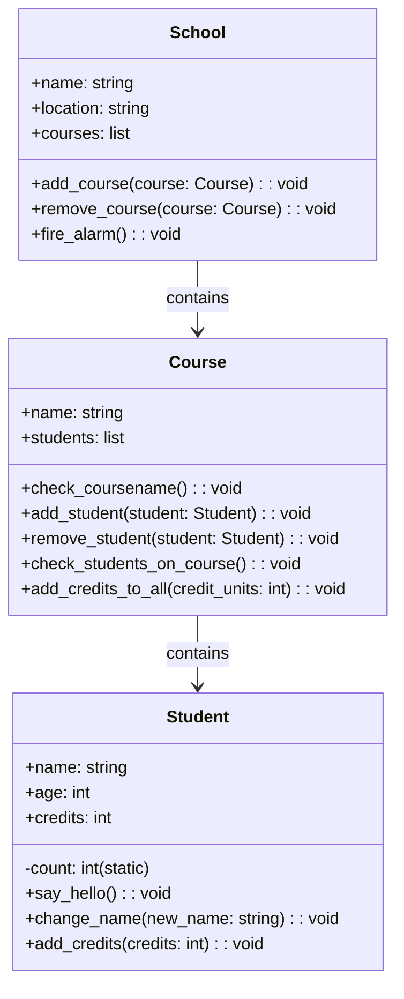
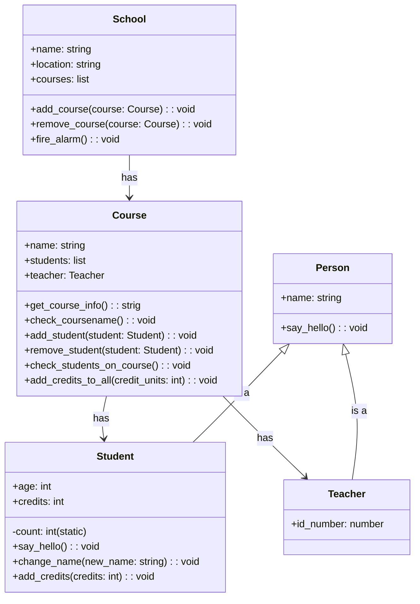

# Class diagrams

Edellisessä harjoituksessa

```mermaid
classDiagram
    class School {
        +name: string
        +location: string
        +courses: list
        +add_course(course: Course): void
        +remove_course(course: Course): void
        +fire_alarm(): void
    }
    
    class Course {
        +name: string
        +students: list
        +check_coursename(): void
        +add_student(student: Student): void
        +remove_student(student: Student): void
        +check_students_on_course(): void
        +add_credits_to_all(credit_units: int): void
    }
    
    class Student {
        -count: int (static)
        +name: string
        +age: int
        +credits: int
        +say_hello(): void
        +change_name(new_name: string): void
        +add_credits(credits: int): void
    }
    
    School --> Course : contains
    Course --> Student : contains

```

## Inheritance/perintä

Lisätään Person-yliluokka ja Teacher-luokka

```mermaid
classDiagram
    class School {
        +name: string
        +location: string
        +courses: list
        +add_course(course: Course): void
        +remove_course(course: Course): void
        +fire_alarm(): void
    }
    
    class Course {
        +name: string
        +students: list
        +teacher: Teacher
        +get_course_info(): strig
        +check_coursename(): void
        +add_student(student: Student): void
        +remove_student(student: Student): void
        +check_students_on_course(): void
        +add_credits_to_all(credit_units: int): void
    }
    
    class Person {
        +name: string
        +say_hello(): void
    }

    class Student {
        -count: int (static)
        +age: int
        +credits: int
        +say_hello(): void
        +change_name(new_name: string): void
        +add_credits(credits: int): void
    }

    class Teacher {
        +id_number: number

    }
    
    
    School --> Course : has
    Course --> Student : has
    Course --> Teacher : has
    Person <|-- Student : is a
    Person <|-- Teacher : is a
```